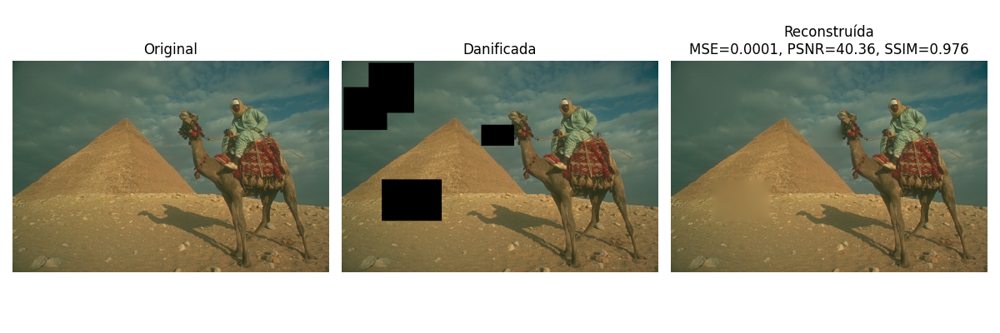
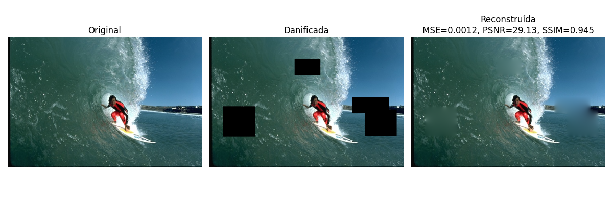
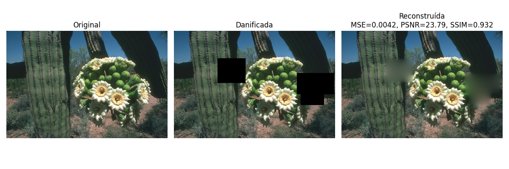
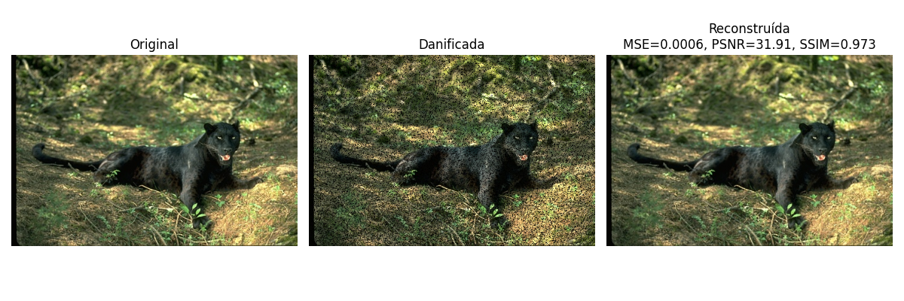
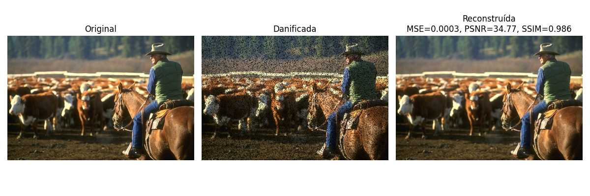

# Projeto de Restauração de Imagens — Métodos Numéricos

Este projeto implementa a reconstrução de imagens danificadas utilizando técnicas de decomposição LU para resolver sistemas lineares provenientes da modelagem da imagem como uma matriz de coeficientes.

O objetivo é demonstrar como métodos numéricos podem ser aplicados em problemas reais de reconstrução e preenchimento de pixels ausentes em imagens.

---

## Demonstração

### Imagem com dano em conjunto

### Imagem com dano esparso

---

## Funcionamento

1. **Carregamento das imagens**  
   O programa seleciona aleatoriamente 10 imagens da pasta `imgdata`.

2. **Dano artificial**  
   Cada imagem é danificada de forma aleatória, podendo:
   - Remover pixels individuais.
   - Criar “buracos” (grupos de pixels ausentes).

3. **Montagem do sistema linear**  
   Cada canal de cor (R, G, B) é transformado em um sistema `Ax = b`, onde:
   - `A` representa as relações entre pixels vizinhos.
   - `b` é o vetor com os valores conhecidos.

4. **Resolução com Decomposição LU**  
   O sistema é resolvido via fatoração `LU`, obtendo o vetor `x` (valores dos pixels faltantes).

5. **Reconstrução e avaliação**  
   A imagem restaurada é comparada com a original usando métricas quantitativas.

---

## Métricas Utilizadas

- **MSE (Erro Quadrático Médio):**  
  Mede a diferença média entre os pixels originais e restaurados.  
  Valores menores indicam melhor reconstrução.

- **PSNR (Pico da Relação Sinal-Ruído):**  
  Mede a qualidade da reconstrução em decibéis.  
  Valores acima de 30 dB geralmente indicam boa qualidade visual.

  ---

## Conclusão

 Como é possível notar, em uma imagem com dano esparso, a reconstrução através de decomposição LU funciona perfeitamente, pois os pixels defeituosos tem muito mais informação disponível para fazer uma média. Já em imagens com dano agrupado, não funciona tão bem devido a falta de informação que alguns pixels terão

